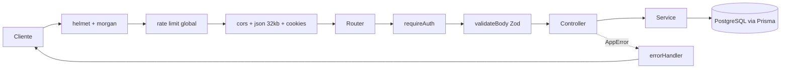
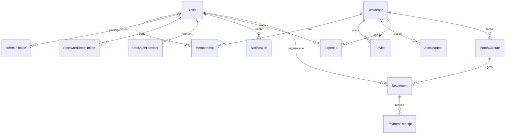
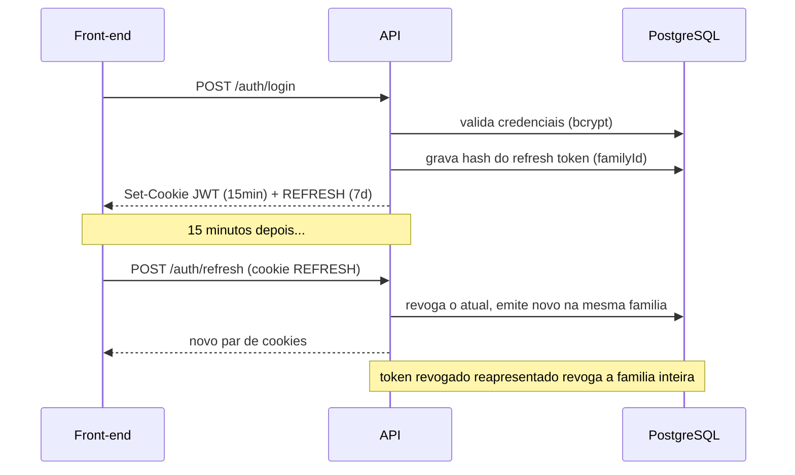
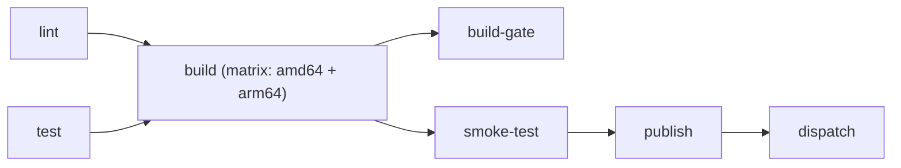
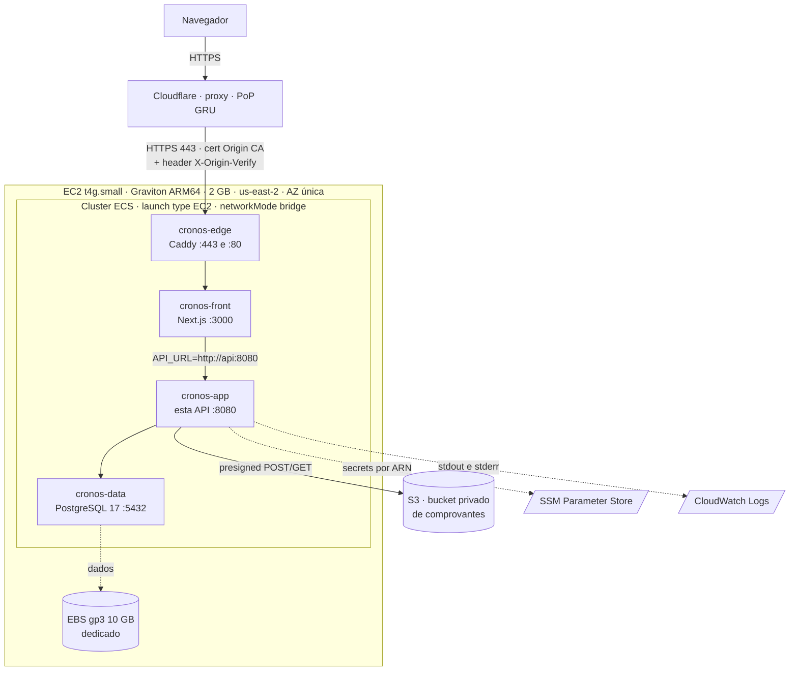

# Sistema de Controle de Despesas — API

API REST em **Node.js + Express 5 + TypeScript** para controle compartilhado de despesas
domésticas. Várias pessoas que moram juntas entram numa mesma **residência**, lançam suas
despesas por competência (mês/ano), fecham o mês e acompanham relatórios de gastos —
individuais e da casa.

Este repositório é a **fonte de verdade do banco de dados** e concentra toda a regra de
negócio. O front-end (Next.js, em repositório separado) consome esta API e não toca o
Postgres diretamente.

Em produção o sistema roda em **`https://cronos.gabrielmizael.com`** — ECS sobre uma única
instância EC2 Graviton, atrás da Cloudflare. Ver [Arquitetura na AWS](#arquitetura-na-aws).

| | |
| --- | --- |
| Front-end | [`sistema-controle-despesas-front`](https://github.com/gbrlmzl/sistema-controle-despesas-front) |
| Orquestração do e2e e infra | [`sistema-controle-despesas-deploy`](https://github.com/gbrlmzl/sistema-controle-despesas-deploy) |

---

## Sumário

- [Stack](#stack)
- [Arquitetura](#arquitetura)
- [Modelo de dados](#modelo-de-dados)
- [Autenticação e sessão](#autenticação-e-sessão)
- [Funcionalidades](#funcionalidades)
- [Referência de endpoints](#referência-de-endpoints)
- [Segurança](#segurança)
- [Observabilidade e operação](#observabilidade-e-operação)
- [Como rodar](#como-rodar)
- [Variáveis de ambiente](#variáveis-de-ambiente)
- [Testes](#testes)
- [CI/CD](#cicd)
- [Arquitetura na AWS](#arquitetura-na-aws)
- [Scripts npm](#scripts-npm)
- [Documentação do projeto](#documentação-do-projeto)

---

## Stack

| Camada | Escolha | Por quê |
| --- | --- | --- |
| Runtime | Node.js 24 (Active LTS) | Suporte até 2028; ESM nativo (`"type": "module"`) |
| Framework | Express 5 | Erros de `async/await` chegam ao error handler sem `express-async-errors` |
| Linguagem | TypeScript 7 (`strict`, `NodeNext`) | Imports relativos com extensão `.js`, como exige o ESM real |
| Banco | PostgreSQL 17 | — |
| ORM | Prisma 7 (`@prisma/adapter-pg`) | Client gerado em `src/generated` |
| Validação | Zod 4 | Schemas de entrada **e** validação das variáveis de ambiente |
| Auth | `jsonwebtoken` + `bcrypt` + Passport (`passport-google-oidc`) | JWT curto + refresh token rotativo; Google OAuth opcional |
| Segurança | `helmet`, `express-rate-limit`, `cors`, `cookie-parser` | Ver [Segurança](#segurança) |
| Email | `nodemailer` sobre SMTP | Recuperação de senha; opcional — sem as variáveis SMTP o envio só vai para o log |
| Armazenamento | AWS SDK v3 (`client-s3`, `s3-presigned-post`, `s3-request-presigner`) | Comprovantes em bucket S3 privado, com upload e leitura pré-assinados |
| Testes | Jest 30 (ESM via `babel-jest`) + Supertest | Unitário + integração |
| Lint e formatação | Biome 2 | Uma ferramenta só no lugar de ESLint + Prettier; configuração em `biome.json` |
| Empacotamento | Docker multi-stage + Docker Compose (perfis `dev`/`prod`) | Imagem final sem dev deps, rodando como usuário `node` |

---

## Arquitetura

Três camadas, com as dependências sempre apontando para dentro:

```
rota  →  controller  →  service  →  Prisma  →  PostgreSQL
```

- **Rota** (`src/routes/**`) — declara o caminho HTTP e a ordem dos middlewares
  (rate limit → autenticação → validação → controller).
- **Controller** (`src/controllers/**`) — traduz HTTP em argumentos simples: lê `params`,
  `query`, `body` e cookies, e devolve status + JSON. É a única camada que conhece o Express.
- **Service** (`src/services/**`) — toda a regra de negócio e o acesso ao banco. Não recebe
  `req`/`res`: quando precisa do IP (para log de segurança), recebe um objeto de contexto
  simples montado pelo controller.

Middlewares transversais em `src/middlewares/`:

| Middleware | Papel |
| --- | --- |
| `auth.ts` | Extrai o JWT do cookie `JWT` ou do header `Authorization: Bearer`, valida e popula `req.user` |
| `validate.ts` | `validateBody(schema)` — valida com Zod e substitui `req.body` pelo dado já parseado |
| `rateLimit.ts` | Limitadores global e por rota sensível |
| `errorHandler.ts` | `notFoundHandler` (404) + handler central de erros |

O tratamento de erro é centralizado: os services lançam `AppError(status, mensagem)`
(`src/utils/AppError.ts`) e o `errorHandler` converte em resposta. Erros inesperados viram
`500` genérico em produção — a mensagem real fica só no log.

### Fluxo de uma requisição



`GET /health` é registrado **antes** do rate limiting (um 429 no health check derrubaria uma
instância saudável do balanceamento) e `GET /ready` **depois** (custa um round trip no banco).

### Estrutura de pastas

```
src/
├── app.ts                 # monta o Express: middlewares globais + rotas
├── server.ts              # sobe o servidor, trata SIGTERM/SIGINT e exceções não capturadas
├── config/
│   ├── env.ts             # validação das env vars com Zod (falha rápido no boot)
│   ├── prisma.ts          # Prisma Client singleton
│   └── passport.ts        # estratégia Google OIDC (registrada só se configurada)
├── controllers/           # auth, users, residences, expenses, payments, reports, notifications
├── services/              # regra de negócio + acesso ao banco (mesmos domínios)
├── routes/                # declaração dos endpoints por domínio
├── schemas/               # schemas Zod de entrada (usuarios, residencias, despesas, notificacoes, acertos)
├── middlewares/           # auth, validate, rateLimit, errorHandler
├── lib/                   # session.ts, username.ts, mailer.ts, emailTemplates.ts, storage.ts
├── utils/                 # AppError, logger, period, readiness, shutdown, tokenPurge, receiptPurge
├── scripts/               # purgeTokens.ts (job avulso) + testMail.ts / testStorage.ts (checagem manual)
├── types/                 # express.d.ts — tipa req.user
└── generated/             # Prisma Client gerado — não editar, fora do coverage e do lint
prisma/                    # schema.prisma + migrations
tests/                     # unit/, integration/, helpers/ (fakes) e setupEnv.ts
docs/                      # planos, arquitetura de auth e revisão de segurança
```

Um padrão recorrente: **comportamento operacional mora em `utils/` com dependências
injetadas**, e o entrypoint só liga os fios. `shutdown.ts`, `readiness.ts`, `tokenPurge.ts` e
`receiptPurge.ts` existem assim para serem testáveis sem subir servidor, derrubar o Postgres,
falar com a AWS ou chamar `process.exit` de verdade. O mesmo vale para os recursos externos:
`lib/mailer.ts` e `lib/storage.ts` são **portas com implementação trocável** — sem configuração
o email apenas vai para o log e o storage responde `503`, e nos testes as duas viram fakes em
memória.

Uma exceção deliberada ao corte por domínio: `services/reports/splitService.ts` (rateio e
simplificação de dívidas) não importa nenhum outro service, para que tanto `expensesService`
(fechamento de mês) quanto `reportsService` possam usá-lo sem criar ciclo de import.

---

## Modelo de dados



| Modelo | Papel |
| --- | --- |
| `User` | Conta. `username` é o identificador **público** (convite sem expor e-mail); `password` é opcional (contas só-Google) |
| `UserAuthProvider` | Vínculo com provedor externo (`provider` + `providerId` únicos) |
| `RefreshToken` | Sessão persistida. Guarda o **hash**, nunca o token; `familyId` agrupa a cadeia de rotação |
| `PasswordResetToken` | Link de "esqueci minha senha". Mesmo padrão do `RefreshToken`: só o hash SHA-256 é guardado; `usedAt` significa "não vale mais" (consumido ou superado por um pedido novo) |
| `PasswordResetAttempt` | Contador de pedidos de redefinição por conta, no banco — é o que sustenta o teto de 3 emails/hora mesmo com várias instâncias |
| `Residence` | Casa compartilhada. `code` é um código público de 6 caracteres; `archivedAt` deixa a residência somente leitura |
| `Membership` | Vínculo usuário↔residência com papel `OWNER` ou `MEMBER` |
| `Invite` | Convite de dentro para fora (owner convida por username); expira em 7 dias |
| `JoinRequest` | Solicitação de fora para dentro (usuário digita o código) |
| `JoinAttempt` | Contador de tentativas de código erradas — no banco, para sobreviver a restart e funcionar com várias instâncias |
| `Expense` | Despesa numa competência (mês/ano). `valueInCents` em **centavos**: ponto flutuante acumula erro na soma e o rateio depende de totais exatos |
| `MonthClosure` | Fechamento do mês pelo owner; competência fechada fica somente leitura. `settledAt` é carimbo de auditoria — o estado de verdade é derivado das linhas de `Settlement` |
| `Settlement` | Um **par devedor→credor** (`payerId`/`receiverId`) resultado da simplificação de dívidas no fechamento, com `amountInCents` já congelado. Liquidado quando `paidAt` **e** `confirmedAt` existem, ou quando `waivedAt` existe (dispensa do owner) |
| `PaymentReceipt` | Comprovante de pagamento (sempre do lado devedor), armazenado no S3. Nasce `PENDING` junto com a URL de upload e só vira `STORED` depois que a API confirma o objeto no bucket |
| `Notification` | Notificação genérica — `title`/`message`/`linkTo` já resolvidos por quem publica |

Enums: `MembershipRole`, `AccessStatus`, `ExpenseCategory`
(`ALIMENTACAO`, `DOMESTICAS`, `ASSINATURAS`, `LAZER`, `OUTROS`), `NotificationType` e
`ReceiptStatus` (`PENDING`, `STORED`).

---

## Autenticação e sessão

Desenho alinhado à RFC 9700 (OAuth 2.0 Security BCP) e ao OAuth 2.1:

- **Access token** — JWT assinado, curto (15 min por padrão), stateless, em cookie `httpOnly`
  chamado `JWT`. Também aceito via `Authorization: Bearer` (útil para testes e clientes
  não-browser).
- **Refresh token** — valor **opaco** (aleatório, não JWT), de 7 dias, em cookie `httpOnly`
  chamado `REFRESH`. O banco é sempre a fonte de verdade sobre validade.
- **Nunca em texto puro no banco** — só o hash SHA-256 é armazenado (o valor já tem alta
  entropia, então não precisa do custo de bcrypt).
- **Rotação de uso único** — cada `POST /auth/refresh` consome o token atual e emite outro.
- **Janela de graça de 10 s na rotação** — um token recém-rotacionado ainda é aceito por 10
  segundos, **desde que exista um sucessor vivo na mesma família**. Sem isso, "reuso" e
  "concorrência" seriam a mesma coisa: várias abas, um prefetch e um `fetch` que toma 401 no mesmo
  instante carregam todos o **mesmo** cookie, porque nenhum viu ainda o `Set-Cookie` do outro — e a
  segunda chamada derrubava a sessão em todos os dispositivos com um alerta de roubo falso. O
  critério "tem irmão vivo na família" é o que separa os casos sem coluna nova no banco: rotação
  legítima deixa um sucessor; logout, troca de senha e a própria detecção de reuso não deixam
  nenhum — então **nenhum dos três é ressuscitado** pela janela. O `revokedAt` também nunca é
  reescrito, para que reapresentar o token a cada 10 s não empurre a janela para a frente
  indefinidamente.
- **Detecção de reuso** — um token revogado **há mais tempo que a janela de graça** sendo
  reapresentado é sinal de roubo: a **família inteira** daquela sessão é revogada e o evento
  `refresh_token_reuse` vai para o log. Dentro da janela, o evento emitido é outro
  (`refresh_token_grace_reuse`), justamente para não acionar quem responde a alerta de segurança.
- **Logout revoga de verdade** — marca o token como revogado, não apenas limpa o cookie.
- **Troca de senha derruba todas as sessões** — revoga tudo e reabre a sessão apenas no
  dispositivo atual (nessa ordem, para o próprio usuário não cair junto).
- **Senhas** com bcrypt.

**Login com Google é opcional.** As quatro variáveis (`GOOGLE_CLIENT_ID`,
`GOOGLE_CLIENT_SECRET`, `GOOGLE_CALLBACK_URL`, `COOKIE_SESSION_SECRET`) precisam ser
fornecidas **juntas ou nenhuma** — o schema de env rejeita o meio-termo. Sem elas, as rotas
`/auth/google*` sequer são registradas e a API roda só com credenciais. O `cookie-session`
existe apenas para sobreviver ao handshake OAuth (proteção CSRF via `state`); sessão de
usuário é sempre JWT em cookie `httpOnly`.

**Recuperação de senha ("esqueci minha senha")** — `POST /auth/forgot-password` responde
**sempre** `200` com a mesma mensagem, exista ou não conta com aquele email: diferenciar a
resposta abriria enumeração de contas cadastradas. O email em si é despachado **sem
aguardar o envio**, para que o tempo de resposta também não vire um oráculo (conta que
existe levaria o round trip do SMTP; conta que não existe, quase zero). O token de reset
segue o mesmo padrão do refresh token — opaco, guardado só como hash SHA-256 — e é de **uso
único e válido por 30 minutos** (`PASSWORD_RESET_TOKEN_EXPIRES_IN`); pedir um link novo
invalida qualquer um anterior ainda não usado. Redefinir a senha **derruba todas as
sessões** do usuário (mesmo mecanismo da troca de senha autenticada) mas **não** reabre
sessão nenhuma — o usuário é mandado para a tela de login, porque um link de email é copiado
e encaminhado com muito mais facilidade do que uma sessão ativa deveria permitir. O envio de
email é opcional: sem o grupo de 5 variáveis `SMTP_*`, a API sobe normalmente e o "envio"
apenas fica registrado em log (com o link, em `development`) — é o que mantém o CI verde sem
segredo nenhum. Detalhes completos em
[`docs/plano-recuperacao-de-senha.md`](docs/plano-recuperacao-de-senha.md).

O percurso completo — do cookie no navegador, passando pelo proxy do front, até o
`loadUserResidenceContext` que decide a autorização em cada service — está descrito em
[`docs/arquitetura-autenticacao-e-autorizacao.md`](docs/arquitetura-autenticacao-e-autorizacao.md).



---

## Funcionalidades

**Contas e perfil**
- Cadastro com nome, username, e-mail e senha (mín. 8 caracteres, com número ou símbolo).
- Login por username + senha, ou com Google.
- Edição de nome e avatar (whitelist de 20 avatares servidos pelo front).
- Troca de senha com revogação de todas as sessões.

**Residências**
- Criar residência (nome de 3–40 caracteres) — quem cria vira `OWNER`.
- Código público de 6 caracteres, regenerável pelo owner.
- **Dois fluxos de entrada:** o owner convida por username (convite expira em 7 dias) ou o
  usuário digita o código e envia uma solicitação.
- Aceitar/recusar/cancelar convites e solicitações, com cooldown após recusa e bloqueio
  temporário depois de tentativas seguidas de código inválido.
- Sair da residência, remover membro, transferir a propriedade e arquivar (somente leitura).

**Despesas**
- Lançamento por competência (mês/ano), com categoria e valor em centavos.
- Despesas **recorrentes**: repetidas automaticamente na competência seguinte ao fechar o mês,
  com endpoint dedicado para interromper a recorrência.
- Listagem por competência, listagem das recorrentes e listagem das competências existentes
  com status (aberta/fechada).
- **Fechamento de mês** pelo owner: a competência vira somente leitura, a seguinte passa a ser a
  aberta e o rateio é congelado em acertos (abaixo). Só o fechamento **mais recente** pode ser
  reaberto — e a reabertura fica bloqueada de vez assim que existir um comprovante anexado
  naquela competência: comprovante é registro financeiro, apagar destruiria prova de pagamento.

**Relatórios**
- Total e distribuição por categoria, com abas **residência** e **pessoal** (a pessoal olha só
  para aquela residência, nunca soma as outras).
- Comparação com a competência anterior.
- Série de evolução das últimas 6 competências.
- Médias por categoria e sinalização de **desvio** acima de 30% em relação à média.
- Rateio do total da casa entre os membros e percentual que o usuário representa do total.
- Lista de despesas pronta para exportação.

**Acertos e comprovantes de pagamento**
- Ao fechar o mês, o rateio é **congelado** e simplificado num conjunto de **pares
  devedor→credor** (algoritmo guloso, sem sobra de centavos).
- Fluxo **simétrico**, por par: o devedor liquida **anexando comprovante**; o credor liquida
  **confirmando o recebimento** daquele valor. Sem ordem obrigatória entre os dois lados.
- Upload em **duas fases** direto do navegador para um bucket S3 privado (presigned POST) — o
  arquivo nunca passa pela API. A confirmação verifica `HeadObject` + assinatura de arquivo
  (magic bytes) sem trazer o conteúdo para a memória.
- O owner pode **dispensar** um acerto travado (morador que saiu, credor que nunca confirma),
  com motivo obrigatório — nunca fica registrado como liquidação.
- **Funciona sem S3 configurado**: `storageEnabled` (mesmo mecanismo de `googleAuthEnabled` e
  `mailEnabled`) desliga só o anexo/leitura de comprovante — o resto (fechamento, confirmação
  de recebimento, dispensa) continua de pé.
- Formatos aceitos: **JPEG, PNG, WebP e PDF, até 5 MB**. SVG (XML executável), GIF e HEIC/HEIF
  ficam de fora de propósito.
- O ciclo inteiro notifica: `SETTLEMENT_PENDING` no fechamento (uma por pessoa, nunca por linha),
  `SETTLEMENT_READY` quando todos os devedores já anexaram, `MONTH_SETTLED` quando a competência
  fica inteiramente quitada e `SETTLEMENT_WAIVED` na dispensa.
- Comprovantes órfãos (upload iniciado e nunca confirmado há mais de 24h) são limpos por
  `npm run purge:tokens`, no mesmo lote das outras purgas.

**Notificações**
- Publicadas por qualquer área do sistema (convite recebido, solicitação respondida, membro
  removido, propriedade transferida, mês fechado, acerto pendente, acertos prontos para
  confirmação, mês quitado, acerto dispensado).
- Listagem paginada (20 por página, teto de 100) com contador de não lidas.
- Marcar itens específicos ou todos como lidos.

---

## Referência de endpoints

Todas as rotas sob `/users`, `/residences` e `/notifications` exigem autenticação.
Respostas de erro seguem sempre o formato `{ "message": "..." }`.

### Auth — `/auth`

| Método | Rota | Descrição |
| --- | --- | --- |
| `POST` | `/register` | Cria a conta, abre a sessão e devolve `201 { user }` |
| `POST` | `/login` | `{ username, password }` → `200 { user }` + cookies |
| `POST` | `/refresh` | Rotaciona o refresh token do cookie e reemite o par |
| `POST` | `/logout` | Revoga o refresh token e limpa os cookies |
| `POST` | `/forgot-password` | `{ email }` → sempre `200`, mensagem fixa (anti-enumeração) |
| `POST` | `/reset-password/verify` | `{ token }` → `200 { valid: true }` ou `400` (link expirado/usado) |
| `POST` | `/reset-password` | `{ token, newPassword, confirmNewPassword }` → `200`, sem cookie |
| `GET` | `/google` | Inicia o OAuth *(só se o Google estiver configurado)* |
| `GET` | `/google/callback` | Abre a sessão e redireciona para `FRONTEND_URL` |

### Usuários — `/users`

| Método | Rota | Descrição |
| --- | --- | --- |
| `GET` | `/me` | Usuário logado + `hasPassword` |
| `PATCH` | `/me` | `{ name?, avatar? }` — ao menos um campo |
| `PATCH` | `/me/password` | `{ currentPassword, newPassword, confirmNewPassword }` — revoga todas as sessões |

### Residências — `/residences`

| Método | Rota | Descrição |
| --- | --- | --- |
| `GET` | `/` | Residências do usuário + convites recebidos + solicitações enviadas |
| `POST` | `/` | `{ name }` |
| `GET` | `/:code` | Residência + convites enviados + solicitações pendentes |
| `PATCH` | `/:code` | `{ name?, archived? }` |
| `POST` | `/:code/code` | Regenera o código público |
| `POST` | `/:code/invites` | `{ username }` |
| `PATCH` | `/invites/:id` | `{ status: "accepted" ou "declined" }` |
| `DELETE` | `/invites/:id` | Cancela o convite |
| `POST` | `/join-requests` | `{ code }` — solicita entrada |
| `PATCH` | `/join-requests/:id` | `{ status: "accepted" ou "declined" }` |
| `DELETE` | `/join-requests/:id` | Cancela a solicitação |
| `DELETE` | `/:code/members/me` | Sai da residência |
| `DELETE` | `/:code/members/:userId` | Remove membro (owner) |
| `PUT` | `/:code/owner` | `{ userId }` — transfere a propriedade |

### Despesas — `/residences/:code/expenses`

| Método | Rota | Descrição |
| --- | --- | --- |
| `GET` | `/` | `?month=&year=` — sem os parâmetros, usa a competência aberta |
| `POST` | `/` | `{ name, valueInCents, category, isRecurring }` |
| `PATCH` | `/:expenseId` | Mesmo corpo do POST |
| `DELETE` | `/:expenseId` | Remove a despesa |
| `DELETE` | `/:expenseId/recurrence` | Interrompe a recorrência |
| `GET` | `/recurring` | Recorrentes do usuário na competência |
| `GET` | `/competencies` | Competências existentes e seus status |
| `POST` | `/month-closures` | `{ month, year }` — fecha o mês (owner) |
| `DELETE` | `/month-closures/:period` | Reabre o mês; `:period` no formato `AAAA-MM` |

### Acertos — `/residences/:code/closures/:period` (`:period` em `AAAA-MM`)

| Método | Rota | Descrição |
| --- | --- | --- |
| `GET` | `/settlements` | Lista os pares devedor→credor da competência fechada, com status derivado e comprovantes `STORED` |
| `POST` | `/settlements/:settlementId/receipts` | `{ contentType, sizeInBytes, originalName? }` — abre a intenção de upload (só o devedor do par); `201` com a URL/campos do presigned POST |
| `POST` | `/settlements/:settlementId/receipts/:receiptId/complete` | Sem corpo — confirma o objeto no S3 (`HeadObject` + magic bytes) e grava `paidAt` |
| `POST` | `/settlements/:settlementId/confirm` | Sem corpo — o credor confirma o recebimento daquele par (`confirmedAt`) |
| `POST` | `/settlements/:settlementId/waive` | `{ reason }` — o owner dispensa a linha inteira, com motivo de 3 a 200 caracteres |
| `GET` | `/receipts/:receiptId/url` | URL pré-assinada de leitura, válida por 5 minutos, emitida sob demanda |

`GET /residences/:code/expenses` embute um bloco `settlement` (status, totais e as linhas do
usuário logado) quando a competência está fechada e tem pelo menos um acerto.

O comprovante aceita `image/jpeg`, `image/png`, `image/webp` e `application/pdf`, até 5 MB. Com o
storage desligado (sem `S3_REGION`/`S3_BUCKET`), **só** as rotas de comprovante respondem `503` —
listar acertos, confirmar recebimento e dispensar continuam de pé.

### Relatórios e notificações

| Método | Rota | Descrição |
| --- | --- | --- |
| `GET` | `/residences/:code/reports` | `?month=&year=&tab=residence` (ou `tab=personal`) |
| `GET` | `/notifications` | `?page=&limit=` (limite máximo 100) |
| `PATCH` | `/notifications` | `{ all: true }` ou `{ ids: [...] }` |

### Infraestrutura

| Método | Rota | Descrição |
| --- | --- | --- |
| `GET` | `/health` | Liveness — não toca o banco, fora do rate limit |
| `GET` | `/ready` | Readiness — faz `SELECT 1`; `503` quando o banco não responde |

---

## Segurança

As decisões abaixo estão detalhadas, com o raciocínio completo, em
[`docs/revisao-seguranca-deploy-aws.md`](docs/revisao-seguranca-deploy-aws.md) — os
identificadores `SEC-*` citados nos comentários do código apontam para as seções desse
documento.

| Controle | Implementação |
| --- | --- |
| Rate limiting | Teto global de 120 req/min por IP; login 8/15min (só falhas contam), registro 10/h (sucesso conta), refresh 30/15min |
| Desarmar limitador | `RATE_LIMIT_DISABLED=true` existe para a suíte e2e do front rodando localmente e **só tem efeito em `development`** — em produção e em `test` é ignorada, para que a variável copiada por engano num servidor não desligue a proteção |
| Afrouxar limitador | `RATE_LIMIT_GLOBAL`, `RATE_LIMIT_LOGIN`, `RATE_LIMIT_REGISTER`, `RATE_LIMIT_REFRESH`, `RATE_LIMIT_FORGOT_PASSWORD`, `RATE_LIMIT_RESET_PASSWORD` trocam o **número**, nunca desligam o middleware — valem em produção (é como o e2e orquestrado roda contra a imagem real) e qualquer desvio do padrão sai no log de boot como `rate_limit_override` |
| `trust proxy` | Fixado em `1` — confiar na cadeia inteira deixaria qualquer cliente forjar `X-Forwarded-For` e escapar do limite |
| Cabeçalhos | `helmet` com HSTS de 180 dias; CSP desligado (a API só devolve JSON) |
| CORS | Origem única (`FRONTEND_URL`) com `credentials: true` |
| Tamanho de corpo | `express.json({ limit: '32kb' })`; corpo grande vira `413`, JSON inválido vira `400` |
| Vazamento de erro | Em produção o cliente recebe `"Erro interno do servidor."`; nome de tabela, constraint e host do banco ficam só no log |
| Paginação | Teto de 100 itens por página — sem isso, `?limit=1000000` trava uma conexão do banco |
| Sessão | Cookies `httpOnly`, `secure` em produção, `sameSite: lax`; refresh rotativo com detecção de reuso |
| Comprovantes | Bucket privado e versionado; presigned POST com `content-length-range` e whitelist de 4 tipos, então o teto de 5 MB é aplicado pelo próprio S3. A API confere `HeadObject` + magic bytes antes de gravar `paidAt` e nunca serve o arquivo: leitura é sempre URL pré-assinada de 5 minutos |
| Limpeza | `npm run purge:tokens` remove refresh tokens expirados/revogados (30 dias), tokens/tentativas de redefinição de senha (7 dias) e comprovantes `PENDING` com mais de 24h — o objeto no S3 junto com a linha — job avulso, não `setInterval` dentro da API |
| Recuperação de senha | Rate limit dedicado (`/forgot-password` 5/h, `/reset-password*` 10/h por IP) + teto de 3 emails/hora por conta, cobrindo também a conta só-Google que não emite token |

---

## Observabilidade e operação

- **Logs de requisição** — `morgan` no formato `combined` em produção (consultável no
  CloudWatch) e `dev` localmente; silenciado nos testes.
- **Eventos de segurança** — `logSecurityEvent` emite **JSON de uma linha** no stderr, com
  chaves estáveis, justamente para virar *metric filter* + alarme no CloudWatch. Eventos:
  `refresh_token_reuse`, `refresh_token_grace_reuse`, `login_failed`, `rate_limit_exceeded`,
  `rate_limit_override` (no boot, quando algum teto foi alterado por variável de ambiente),
  `password_reset_token_reuse`, `password_reset_throttled` e `receipt_content_mismatch` (o arquivo
  que chegou no bucket não bate com o `Content-Type` declarado na intenção de upload). Nada de
  segredo é registrado — só identificadores e o IP de origem.
  Os dois primeiros pedem tratamento oposto no CloudWatch: `refresh_token_reuse` é **alarme**;
  `refresh_token_grace_reuse` é **métrica** — esperado em volume baixo, e um pico denuncia um
  cliente multiplicando renovações (foi exatamente o sintoma de quando o `apiClient.ts` do Next
  renovava durante o render, sem conseguir persistir o cookie).
- **Liveness vs. readiness** — `/health` responde "o processo está vivo?" (reiniciar resolve) e
  não toca o banco; `/ready` responde "dá para atender agora?" e retorna `503` quando o
  Postgres não responde (tirar do balanceamento, não reiniciar).
- **Graceful shutdown** — `SIGTERM`/`SIGINT` fecham o servidor HTTP, desconectam o Prisma e só
  então encerram o processo, para que requisições em voo não morram a cada deploy ou scale-in.
- **Falha rápida no boot** — variável de ambiente inválida derruba o processo na inicialização,
  em vez de causar erro obscuro na primeira requisição.

---

## Como rodar

### Pré-requisitos

Node.js ≥ 24 e PostgreSQL 17 (ou apenas Docker, para o caminho com Compose).

### Local

```bash
npm ci
```

Copie o `.env.example` para `.env` e gere o segredo do JWT (mínimo 32 caracteres):

```bash
node -e "console.log(require('crypto').randomBytes(32).toString('hex'))"
```

Aplique as migrations e suba a API:

```bash
npx prisma migrate deploy
```

```bash
npm run dev
```

A API sobe em `http://localhost:8080`.

### Docker Compose

Perfil **dev** — Postgres + migrations + API com hot reload (`tsx watch`), código montado como
volume:

```bash
docker compose --profile dev up
```

Perfil **prod** — a mesma imagem enxuta que o CI publica (estágio `runtime`):

```bash
docker compose --profile prod up --build
```

Em ambos os perfis o serviço `migrate` roda `prisma migrate deploy` uma vez e sai: **migração
nunca acontece dentro do processo que serve tráfego**. A imagem final roda como usuário `node`
(não root), sem dev dependencies, e traz um `HEALTHCHECK` que reaproveita `GET /health`.

---

## Variáveis de ambiente

Validadas por Zod em [`src/config/env.ts`](src/config/env.ts) — o processo não sobe com
configuração inválida.

| Variável | Obrigatória | Padrão | Descrição |
| --- | --- | --- | --- |
| `NODE_ENV` | não | `development` | `development`, `test` ou `production` |
| `PORT` | não | `8080` | Porta HTTP |
| `DATABASE_URL` | **sim** | — | String de conexão do PostgreSQL |
| `FRONTEND_URL` | não | `http://localhost:3000` | Origem do CORS e destino do redirect pós-OAuth |
| `JWT_SECRET` | **sim** | — | Mínimo de 32 caracteres |
| `JWT_EXPIRES_IN` | não | `15m` | Vida do access token |
| `REFRESH_TOKEN_EXPIRES_IN` | não | `7d` | Vida do refresh token |
| `GOOGLE_CLIENT_ID` | condicional | — | As quatro variáveis do Google são exigidas |
| `GOOGLE_CLIENT_SECRET` | condicional | — | juntas — ou nenhuma delas, e aí o |
| `GOOGLE_CALLBACK_URL` | condicional | — | login com Google fica desabilitado |
| `COOKIE_SESSION_SECRET` | condicional | — | Assina o cookie de `state` do OAuth (mín. 32 caracteres) |
| `RATE_LIMIT_DISABLED` | não | `false` | Desarma os limitadores para a suíte e2e local do front — **ignorada** fora de `development` |
| `RATE_LIMIT_GLOBAL` | não | `120`/min | Teto de cada limitador, por IP. Valem em produção (o e2e |
| `RATE_LIMIT_LOGIN` | não | `8`/15min | orquestrado afrouxa os números sem desarmar nada) e são |
| `RATE_LIMIT_REGISTER` | não | `10`/h | **ignoradas** em `test`, onde o teto exercitado tem que ser |
| `RATE_LIMIT_REFRESH` | não | `30`/15min | o do código. Em branco = o padrão ao lado. Qualquer |
| `RATE_LIMIT_FORGOT_PASSWORD` | não | `5`/h | desvio é registrado no boot como `rate_limit_override` |
| `RATE_LIMIT_RESET_PASSWORD` | não | `10`/h | (SEC-10) |
| `PASSWORD_RESET_TOKEN_EXPIRES_IN` | não | `30m` | Validade do link de redefinição de senha |
| `PASSWORD_RESET_PATH` | não | `/change-password` | Caminho da tela de redefinição no front (compõe o link com `FRONTEND_URL`) |
| `SMTP_HOST` | condicional | — | As cinco variáveis SMTP são exigidas |
| `SMTP_PORT` | condicional | — | juntas — ou nenhuma delas, e aí o envio |
| `SMTP_USER` | condicional | — | de email só é registrado em log (sem |
| `SMTP_PASSWORD` | condicional | — | recuperação de senha por email de verdade) |
| `MAIL_FROM` | condicional | — | Remetente — precisa ser o mesmo endereço de `SMTP_USER` no Gmail |
| `S3_REGION` | condicional | — | `S3_REGION` e `S3_BUCKET` juntos **ligam** o storage de comprovantes |
| `S3_BUCKET` | condicional | — | (`storageEnabled`) — sem os dois, só o anexo/leitura de comprovante responde `503` |
| `S3_ACCESS_KEY_ID` | condicional | — | Só em desenvolvimento; em produção fica vazia e o SDK usa a role da task do ECS |
| `S3_SECRET_ACCESS_KEY` | condicional | — | juntas com `S3_ACCESS_KEY_ID` — ou nenhuma das duas |
| `S3_ENDPOINT` | não | — | Aponta a um S3 compatível (MinIO/LocalStack); vazio é AWS de verdade |
| `RECEIPT_MAX_SIZE_BYTES` | não | `5242880` | Teto de tamanho do comprovante (5 MB), aplicado pelo próprio S3 via presigned POST |
| `RECEIPT_UPLOAD_URL_EXPIRES_IN` | não | `300` | Validade em segundos da URL de upload |
| `RECEIPT_DOWNLOAD_URL_EXPIRES_IN` | não | `300` | Validade em segundos da URL de leitura |

---

## Testes

```bash
npm test
```

```bash
npm run test:coverage
```

34 arquivos de teste, divididos entre `tests/unit/` (schemas Zod, regras dos services,
utilitários operacionais) e `tests/integration/` (Supertest contra o app real, com banco).
A integração cobre os fluxos de auth, residências, despesas, notificações, usuários e acertos
de pagamento, além de casos especificamente de segurança: rate limiting, troca de senha,
recuperação de senha por email, purga de tokens e emissão dos eventos de segurança.

O armazenamento de comprovantes (`src/lib/storage.ts`) é uma porta injetável, no mesmo molde
do envio de email: **nenhum teste automatizado abre conexão com a AWS**. Os testes trocam a
implementação ativa por um fake em memória (`tests/helpers/fakeStorage.ts`) via
`setStorageForTests`.

E a suíte **não herda o `.env` de quem a roda**: `tests/setupEnv.ts` (registrado em `setupFiles`,
o único momento anterior ao import de qualquer módulo do projeto) zera `S3_REGION` e `S3_BUCKET`
antes de `src/config/env.ts` calcular `storageEnabled`. Sem isso, uma máquina de desenvolvimento
com S3 configurado fazia `setStorageForTests(null)` restaurar o adapter S3 **de verdade**, e o
teste de degradação graciosa recebia `201` onde exige `503` — falhando por causa do ambiente, não
do código (no CI passava, porque lá não existe `.env` nenhum). O valor gravado é **string vazia**,
não `delete`: o `dotenv` repõe qualquer chave ausente, e só o `optionalString()` do schema
converte `''` em `undefined`.

Detalhe deliberado: **os limitadores ficam desarmados em `NODE_ENV=test`**, porque a suíte
dispara dezenas de requisições nas mesmas rotas de propósito — do contrário ela testaria o
limitador, não o endpoint. Existe um gancho (`setRateLimitersArmedInTests`) que arma os
limitadores **reais** nas rotas reais, para que um refactor não consiga desligar a proteção
sem nenhum teste acusar.

O Jest roda em **modo ESM nativo** (`--experimental-vm-modules` + `babel-jest`), exigência do
client novo do Prisma.

---

## CI/CD

[`.github/workflows/ci.yml`](.github/workflows/ci.yml), em sete jobs — `lint` e `test` rodam em
paralelo, e o `build` só começa se os dois passarem:



1. **lint** — `npm run lint:ci` (`biome ci` com o reporter do GitHub, que anota os problemas
   direto nas linhas do PR). Formatação, ordem dos imports e as regras `recommended` do
   `biome.json`. Um lint vermelho barra o build e, com ele, a publicação e o deploy.
2. **test** (check "Testes (unitário + integração)") — sobe um Postgres de serviço, aplica
   migrations, builda e roda a suíte completa (com `JWT_SECRET` efêmero gerado no próprio job).
3. **build** — `needs: [lint, test]`. `docker compose --profile prod build` numa **matrix de duas
   plataformas**, salvando as imagens `api` e `api-migrate` de cada arquitetura como artifact.
4. **build-gate** — não builda nada: republica o resultado da matrix sob um **nome fixo**, porque
   o nome dos checks de uma matrix carrega a plataforma e muda toda vez que a matrix muda — um
   required status check apontando para lá trava o merge em "waiting for status". Roda com
   `if: always()`, já que um required check *skipped* conta como aprovado no GitHub. Como o
   `build` depende do `lint`, um lint vermelho também deixa este gate vermelho.
5. **smoke-test** — sobe a stack inteira com as imagens recém-construídas e espera `/health`
   responder.
6. **publish** *(só em `main`)* — publica cada arquitetura numa tag intermediária e monta o
   **manifest multi-arch** com `docker buildx imagetools create`, nas tags `:sha` e `:latest`
   (`docker save`/`load` não preserva manifest list, daí o rodeio).
7. **dispatch** *(só em `main`)* — avisa o repositório de deploy para rodar o e2e contra
   aquela tag exata. Passando, a imagem é repromovida a `:stable`, espelhada no ECR e implantada
   no ECS depois de uma aprovação manual (ver [Deploy](#deploy-o-que-é-automático-e-o-que-não-é)).

> **Ao mexer na branch protection:** o check do job de testes se chama "Testes (unitário +
> integração)", não mais `test`. Um required check com o nome antigo deixa o PR preso em
> *Expected — Waiting for status to be reported*. Vale incluir também o "Lint".

**Por que multi-arch, se o deploy é só ARM.** O alvo de produção é Graviton (`linux/arm64`), e
por um tempo a imagem foi arm64 puro. O problema apareceu do outro lado: o e2e orquestrado roda
num runner `ubuntu-latest` **amd64**, e com só a variante ARM disponível ele subia a API inteira
emulada por QEMU — onde o bcrypt do `POST /auth/register` estoura o timeout padrão do Cypress e a
suíte falha de forma intermitente. O leg amd64 é nativo no runner; só o arm64 precisa de QEMU.

O CI publica **duas** imagens. A segunda, `…-api-migrate`, é o estágio `build` do Dockerfile
(toolchain completo) e existe para rodar `prisma migrate deploy`. Ela é promovida e espelhada no
ECR junto com a API, mas **ainda não é consumida**: em produção a migration roda numa task
`cronos-migrate` derivada da `cronos-app`, com a imagem da própria API.

---

## Arquitetura na AWS

Onde esta API roda em produção, e por quê. O detalhamento completo — decisões, custos, comandos e o
histórico de cada fase — vive no repositório de deploy
([`sistema-controle-despesas-deploy/docs/`](https://github.com/gbrlmzl/sistema-controle-despesas-deploy/tree/main/docs));
aqui fica o mapa e o que ele implica para quem mexe neste código.

> **O que esta seção não traz, de propósito:** ID da conta AWS, o Elastic IP da instância, IDs de
> instância/security group e o valor de qualquer segredo. O IP em particular **não é detalhe
> cosmético** — o desenho inteiro depende de a origem ser inalcançável fora da borda, e publicá-lo
> desfaria isso. Segredo nenhum mora em arquivo versionado: tudo vem do SSM Parameter Store.

### A topologia



| Peça | Escolha | Por quê |
| --- | --- | --- |
| Compute | **1 EC2 `t4g.small`** (Graviton, ARM64, 2 GB), ASG `min=max=1` | Instância única já paga: o custo marginal de cada container é zero. ARM corta boa parte do preço da mesma capacidade x86 |
| Orquestração | **ECS com launch type EC2**, `networkMode: bridge` | Fargate cobraria por task e não suporta `extraHosts`; o `bridge` com portas fixas no host é o que deixa quatro services conversarem sem service discovery |
| Banco | **Postgres 17 em container**, dados em **EBS gp3 dedicado** | RDS `db.t4g.micro` custaria ~US$ 12,65/mês a mais. O volume é separado do disco raiz porque o raiz **morre com a instância** — e substituir instância é operação normal num ASG |
| Backup | Snapshot diário via **DLM**, retenção 7 dias | Um volume EBS vive numa única AZ, e é isso que prende o ASG a uma AZ só |
| Imagens | CI publica no **GHCR**; produção puxa do **ECR** | O pacote do GHCR é privado, e puxar de registry de terceiro exigiria `repositoryCredentials` + Secrets Manager. Com ECR a `ecsTaskExecutionRole` já autentica sozinha |
| Segredos | **SSM Parameter Store**, tier Standard (`SecureString` sobre KMS `aws/ssm`) | Gratuito. O Secrets Manager faria o mesmo com rotação automática, por US$ 0,40/segredo/mês — pagar por rotação que não acontece |
| Logs | **CloudWatch Logs**, um log group por service, retenção 7 dias | É o destino do `morgan` e do `logSecurityEvent` |
| Entrada | **Cloudflare** (proxied) → **Caddy** na instância | Ver "A borda" |
| Balanceador | **nenhum ALB** | ~US$ 16/mês para distribuir tráfego entre uma instância só. É a decisão de maior impacto financeiro da infra |

Quatro services, um container cada — `cronos-data`, `cronos-app` (esta API), `cronos-front` e
`cronos-edge`. **Separar em tasks distintas custa US$ 0,00 e evita que todo deploy do front
reinicie a API junto**: no ECS a task é a unidade atômica de implantação, e com `essential: true`
um crash do front derrubaria a API na mesma task.

### O que isso impõe a este código

Nada aqui é decoração de infraestrutura — são restrições que aparecem no código da API:

| Restrição | Onde aparece |
| --- | --- |
| **Imagem `linux/arm64`** | A instância é Graviton: uma task amd64 morre com `exec format error`. É a razão da matrix de plataformas no CI |
| **`readonlyRootFilesystem: true`** | A task roda com o filesystem raiz travado — uma RCE não consegue gravar payload. A API não escreve em disco, e por isso não precisa de `tmpfs` nenhum (o front precisa, para o cache do Next) |
| **Limite rígido de memória (448 MiB)** | O documento de arquitetura recomenda limite flexível em quase tudo; a API levou rígido de propósito. Sem ele, um vazamento cresce até o kernel escolher uma vítima — e o OOM killer tende a escolher o **maior** processo, que seria o Postgres. Com o limite, uma API descontrolada morre sozinha |
| **`GET /health` como health check da task** | E **não** `/ready`. O health check do container responde "reiniciar resolve?"; um `/ready` ali faria uma indisponibilidade do banco reiniciar a API em loop, que é a reação errada |
| **Graceful shutdown** | `desiredCount=1` com porta fixa no host obriga `minimumHealthyPercent=0`: a task antiga **sai antes** de a nova entrar. O `SIGTERM` tratado em `server.ts` é o que evita matar requisições em voo a cada deploy |
| **Migração fora do processo que serve tráfego** | Em produção a migration é um `ecs run-task` avulso de `cronos-migrate`: a task definition da API sem `portMappings` e sem health check, com `command` trocado por `prisma migrate deploy`. Mesmo princípio do serviço `migrate` do Compose. Ela roda **antes** do `update-service`, com a versão anterior da API ainda no ar, por isso toda migration precisa ser retrocompatível (*expand/contract*) |
| **`purge:tokens` como job avulso** | Nunca um `setInterval` dentro da API — que rodaria N vezes se um dia houver N instâncias |
| **Cookies `secure` em produção** | Implica HTTPS obrigatório de ponta a ponta, o que faz a borda ser requisito, não enfeite |
| **Proxy same-origin no front** | O navegador nunca fala com esta API direto. Por isso o CORS tem origem única, e a `GOOGLE_CALLBACK_URL` aponta para o **domínio do front**, não para o endereço da API |

### Segredos: por que `secrets` e não `environment`

Variável de ambiente numa task definition é **texto plano**, legível por qualquer pessoa com
permissão de leitura no ECS — no console, num `describe-task-definition`, inclusive para quem só
deveria poder olhar a configuração. O bloco `secrets` guarda apenas o **ARN do parâmetro**, e o
valor real é resolvido em runtime pelo agente ECS.

Os parâmetros vivem sob o prefixo `/cronos/api/*` (e `/cronos/postgres/*` para o banco). O
Parameter Store trata `/` como hierarquia, e é isso que permite escrever a policy IAM sobre
`parameter/cronos/api/*` — dando à execution role acesso a exatamente esses parâmetros e a nenhum
outro da conta. Batizar todo parâmetro novo sob esse prefixo é o que evita mexer em IAM a cada
variável nova.

**Só é `SecureString` o que é segredo de fato.** Usuário e nome do banco são `String` comum: já
estão no `docker-compose.yml` versionado, e marcá-los como secretos daria a falsa impressão de que
não estão.

Duas roles, papéis distintos:

- **Execution role** (`ecsTaskExecutionRole`) — é do **agente ECS**, não do seu código. Puxa a
  imagem do ECR e resolve os `secrets` antes de o container existir.
- **Task role** — é do **processo**, para chamar APIs da AWS em runtime. Ficou **vazia** enquanto a
  API não falava com serviço nenhum da AWS. Com a chegada dos comprovantes no S3 isso deixou de ser
  verdade: o caminho pretendido em produção é a task role, e é por isso que
  `S3_ACCESS_KEY_ID`/`S3_SECRET_ACCESS_KEY` são **opcionais** no `env.ts` — credencial explícita é
  para desenvolvimento local; na AWS o SDK pega a credencial da role sozinho.

### Comprovantes no S3

O bucket é **privado e versionado**, e o arquivo **nunca passa pela API**: o navegador faz o upload
direto por *presigned POST* (não PUT — só o POST aceita `content-length-range` como condição
assinada, que é o que faz o teto de 5 MB ser aplicado pelo **próprio S3**). A leitura é sempre URL
pré-assinada de 5 minutos, emitida sob demanda.

Isso tem duas consequências operacionais:

- O bucket precisa de **CORS**, e com os métodos certos. `POST` cobre o upload; **`GET` também é
  necessário**, porque o front lê a imagem por `fetch` para convertê-la antes de salvar. O PDF não
  depende disso (sai por navegação com `Content-Disposition: attachment`, e navegação não passa por
  CORS) — então a falta do `GET` quebra **só** o download de comprovante-imagem.
- Sem `S3_REGION`/`S3_BUCKET` a API sobe normalmente e **só** as rotas de comprovante respondem
  `503` (`storageEnabled`, mesmo mecanismo de `googleAuthEnabled` e `mailEnabled`). Isso não é
  tolerância a erro de configuração: é o que permite um ambiente sem S3 — CI incluído — exercitar
  todo o resto do fluxo de acertos.

### A borda

```
Internet ──HTTPS──▶ Cloudflare ──HTTPS :443──▶ Caddy ──▶ front :3000 ──▶ api :8080
                    (proxy, PoP GRU)  (Origin CA)  (valida X-Origin-Verify)
```

A origem é **fechada**: o Security Group libera a 443 apenas para a prefix list de IPs da
Cloudflare, e o TLS até a origem usa um certificado **Origin CA** com a Cloudflare em modo *Full
(strict)*. Como essa prefix list libera a Cloudflare **inteira**, uma Transform Rule injeta um
header secreto (`X-Origin-Verify`) que o Caddy valida — sem ele, qualquer cliente da Cloudflare
poderia apontar um proxy para a origem.

Um caminho antigo via CloudFront (porta 80, restrita à prefix list gerenciada da AWS) continua vivo
em paralelo, deliberadamente: enquanto os dois servem o mesmo sistema, o rollback é trocar de URL.

Duas coisas que essa borda cobra deste código:

- **`trust proxy` fixado em `1`.** Confiar na cadeia inteira deixaria qualquer cliente forjar
  `X-Forwarded-For` e escapar do rate limit. O Caddy reescreve o header a partir do
  `CF-Connecting-IP`, mas **fixar o número certo de saltos é uma verificação em aberto**: se a API
  registrar IP privado ou IP da Cloudflare nos eventos de segurança, o limitador está colocando o
  mundo inteiro no mesmo balde.
- **A prefix list da Cloudflare é mantida à mão.** A do CloudFront era gerenciada pela AWS; esta
  não. Se a Cloudflare anunciar uma faixa nova, parte do tráfego começa a dar timeout **sem nenhum
  erro do lado da aplicação**.

### Deploy: o que é automático e o que não é

```
push na main ──▶ CI (lint + test → build → publish GHCR :sha/:latest) ──▶ dispatch
                                                                            │
                          repo de deploy: e2e da stack completa ◀───────────┘
                                     │ passou
                                     ▼
                              re-tag :stable no GHCR
                                     ▼
                  espelhar :stable → ECR (:sha imutável + :stable)
                                     │
                    ─────────────────┼─────────  aprovação manual (environment production)
                                     ▼
       task definition nova ──▶ run-task cronos-migrate ──▶ update-service + wait stable
```

**Tudo é automático até o portão de aprovação.** Depois do e2e verde, o repositório de deploy
promove a imagem, espelha no ECR (por OIDC, sem chave estática) e para o job de deploy em
*Waiting for review*. Com a aprovação, ele registra uma revisão da `cronos-app` com a tag imutável
do commit, roda a migration e só então troca o service. Se a migration sair com código diferente de
zero, o deploy para **antes** do `update-service` e a versão anterior continua no ar; se a revisão
nova não estabilizar, o circuit breaker volta para a anterior. O detalhamento, com o mapa de erros e o
rollback, está em
[`pipeline-ci-cd.md`](https://github.com/gbrlmzl/sistema-controle-despesas-deploy/blob/main/docs/pipeline-ci-cd.md).

O que isso implica para quem mexe neste código:

- **Merge na `main` com CI verde não é "está no ar".** Falta o e2e, a aprovação e a estabilização
  do service. E `:stable` quer dizer "aprovado no e2e", não "em produção": um deploy rejeitado ou
  com falha deixa as duas coisas diferentes.
- **Migration é executada com a API antiga atendendo tráfego.** Renomear ou remover coluna vira
  dois deploys (adiciona → migra → só depois remove).
- **A migration só é testada em banco vazio** (CI e e2e). Uma migration que depende de dados, como
  `NOT NULL` em tabela populada, só falha no passo de produção.

A tag de SHA na task definition é o que mantém o rollback como um comando só: basta apontar o
service para a revisão anterior.

### Pendências de infraestrutura

Estado documentado em **29/08/2026**, com a parte de deploy revista em **14/09/2026**. O runbook de
execução e o retrato mais recente ficam no repositório de deploy — confira lá antes de agir sobre
qualquer item.

| Pendência | Impacto |
| --- | --- |
| **`FRONTEND_URL` ainda é placeholder em produção** | Alimenta o CORS com `credentials: true` e o redirect pós-OAuth. Precisa virar a origem real |
| **Grupos Google OAuth, SMTP e S3 ausentes da task definition** | Código pronto e inerte: o botão do Google não funciona, a recuperação de senha **completa o fluxo sem enviar email** e os comprovantes respondem `503`. ⚠️ Cada grupo é **tudo ou nada** — preencher pela metade **impede a API de subir**, e o sintoma é task que nunca fica `healthy` |
| **Task role sem permissão sobre o bucket** | Sem ela (ou sem credencial explícita), o storage não funciona nem com as variáveis preenchidas |
| **CORS do bucket sem `GET`** | Quebra só o download de comprovante-imagem |
| **Amazon SES está fora como provedor SMTP** | Não é preferência: o `env.ts` valida `SMTP_USER` com `z.email()`, e o usuário SMTP do SES é uma credencial `AKIA…`. Resend (`resend`) e SendGrid (`apikey`) caem pelo mesmo motivo. Passam os provedores cujo login é um endereço |
| **Primeiro deploy automatizado da API não fechou** | Em 14/09 o deploy do merge do Biome falhou no passo de migration (a `cronos-app` publica a porta 8080, ocupada pela API antiga). A correção, a task `cronos-migrate` sem portas, entrou no repositório de deploy no mesmo dia, e o merge do PR #18 dispara o primeiro deploy que já a usa. Até ele estabilizar, a API no ar é a versão anterior e `:stable` está à frente de produção |
| **Todo deploy derruba a API por alguns segundos** | Porta fixa no host obriga `minimumHealthyPercent=0`. A solução planejada (porta dinâmica + Cloud Map + Caddy como roteador) exige o graceful shutdown que o `server.ts` já tem |
| **`Caddyfile` e certificados não sobrevivem à troca da instância** | Criados à mão no host, fora do versionamento da task definition — o que também torna o rollback de revisão uma ilusão parcial: a config volta, o arquivo não |
| **Sem WAF e sem rate limiting na borda** | Decisão de orçamento. O rate limiting da própria API é a única proteção contra abuso de rota |

---

## Scripts npm

| Script | O que faz |
| --- | --- |
| `npm run dev` | API com hot reload (`tsx watch`) |
| `npm run build` | `prisma generate` + `tsc` |
| `npm start` | Roda o build (`dist/server.js`) |
| `npm test` | Suíte completa |
| `npm run test:coverage` | Suíte com relatório de cobertura |
| `npm run lint` | Lint + formatação + ordem dos imports (`biome check`), sem alterar arquivos |
| `npm run lint:fix` | O mesmo, aplicando as correções seguras (`biome check --write`) |
| `npm run lint:ci` | Versão do CI (`biome ci`), com anotações no formato do GitHub |
| `npm run prisma:generate` | Regera o Prisma Client |
| `npm run purge:tokens` | Limpa refresh tokens, tokens de redefinição de senha e comprovantes órfãos expirados, e sai (agendado como task avulsa) |
| `npm run mail:test -- destino@exemplo.com` | Envia um email de teste pelo SMTP configurado, para validar as credenciais |
| `npm run storage:test` | Grava, lê, gera URL e apaga um objeto de teste no S3, para validar bucket e credencial |

---

## Documentação do projeto

Este repositório segue um fluxo **documento primeiro**: decisões de arquitetura e segurança são
escritas, discutidas e aprovadas antes do código.

- [`docs/plano-api-node-express.md`](docs/plano-api-node-express.md) — decisão de separar a API
  do Next.js, arquitetura em camadas, desenho da autenticação, fases de implementação e a
  estratégia de Docker/CI.
- [`docs/arquitetura-autenticacao-e-autorizacao.md`](docs/arquitetura-autenticacao-e-autorizacao.md)
  — descrição do módulo de auth como está implementado, atravessando front, API e borda: fluxos
  de login, renovação e ação autorizada, o modelo de autorização em cinco camadas e os
  trade-offs assumidos.
- [`docs/revisao-seguranca-deploy-aws.md`](docs/revisao-seguranca-deploy-aws.md) — revisão de
  segurança pré-deploy: cada item `SEC-*` referenciado nos comentários do código, mais os itens
  `INFRA-*` da camada AWS.
- [`docs/plano-recuperacao-de-senha.md`](docs/plano-recuperacao-de-senha.md) — decisões
  (`D-*`) e roteiro de implementação da recuperação de senha por email.
- [`docs/plano-registro-de-pagamentos.md`](docs/plano-registro-de-pagamentos.md) — decisões
  (`D-*`/`RN-*`) e roteiro de implementação dos acertos de pagamento com comprovante no S3.
- [`docs/exemplos-insomnia/`](docs/exemplos-insomnia) — exemplos de requisição.

A camada de infraestrutura é documentada no repositório de deploy, com o mesmo critério:
[`arquitetura-aws.md`](https://github.com/gbrlmzl/sistema-controle-despesas-deploy/blob/main/docs/arquitetura-aws.md)
(decisões, custos e cenários), [`api-aws.md`](https://github.com/gbrlmzl/sistema-controle-despesas-deploy/blob/main/docs/api-aws.md)
(a task definition desta API, campo a campo),
[`banco-de-dados-aws.md`](https://github.com/gbrlmzl/sistema-controle-despesas-deploy/blob/main/docs/banco-de-dados-aws.md)
(volume EBS, SSM, IAM) e
[`borda-cloudflare.md`](https://github.com/gbrlmzl/sistema-controle-despesas-deploy/blob/main/docs/borda-cloudflare.md)
(a borda atual).

Os comentários no código explicam **por que** algo é daquele jeito, não o que a linha faz —
vale lê-los ao mexer em `app.ts`, `rateLimit.ts`, `session.ts` e nos utilitários operacionais.

---

## Licença

[MIT](LICENSE) — © 2026 Gabriel Mizael.
