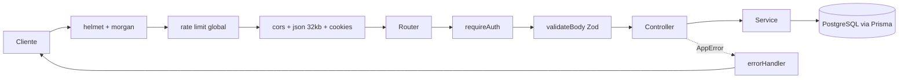
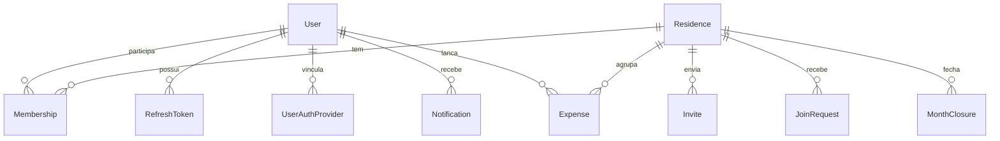
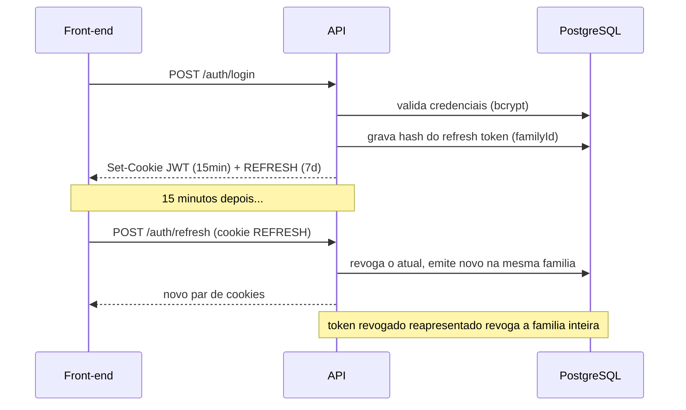
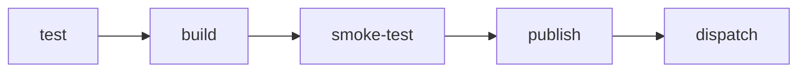

# Sistema de Controle de Despesas — API

API REST em **Node.js + Express 5 + TypeScript** para controle compartilhado de despesas
domésticas. Várias pessoas que moram juntas entram numa mesma **residência**, lançam suas
despesas por competência (mês/ano), fecham o mês e acompanham relatórios de gastos —
individuais e da casa.

Este repositório é a **fonte de verdade do banco de dados** e concentra toda a regra de
negócio. O front-end (Next.js, em repositório separado) consome esta API e não toca o
Postgres diretamente.

---

## Sumário

- [Stack](#stack)
- [Arquitetura](#arquitetura)
- [Modelo de dados](#modelo-de-dados)
- [Autenticação e sessão](#autenticação-e-sessão)
- [Funcionalidades](#funcionalidades)
- [Referência de endpoints](#referência-de-endpoints)
- [Segurança](#segurança)
- [Observabilidade e operação](#observabilidade-e-operação)
- [Como rodar](#como-rodar)
- [Variáveis de ambiente](#variáveis-de-ambiente)
- [Testes](#testes)
- [CI/CD](#cicd)
- [Scripts npm](#scripts-npm)
- [Documentação do projeto](#documentação-do-projeto)

---

## Stack

| Camada | Escolha | Por quê |
| --- | --- | --- |
| Runtime | Node.js 24 (Active LTS) | Suporte até 2028; ESM nativo (`"type": "module"`) |
| Framework | Express 5 | Erros de `async/await` chegam ao error handler sem `express-async-errors` |
| Linguagem | TypeScript 7 (`strict`, `NodeNext`) | Imports relativos com extensão `.js`, como exige o ESM real |
| Banco | PostgreSQL 17 | — |
| ORM | Prisma 7 (`@prisma/adapter-pg`) | Client gerado em `src/generated` |
| Validação | Zod 4 | Schemas de entrada **e** validação das variáveis de ambiente |
| Auth | `jsonwebtoken` + `bcrypt` + Passport (`passport-google-oidc`) | JWT curto + refresh token rotativo; Google OAuth opcional |
| Segurança | `helmet`, `express-rate-limit`, `cors`, `cookie-parser` | Ver [Segurança](#segurança) |
| Testes | Jest 30 (ESM via `babel-jest`) + Supertest | Unitário + integração |
| Empacotamento | Docker multi-stage + Docker Compose (perfis `dev`/`prod`) | Imagem final sem dev deps, rodando como usuário `node` |

---

## Arquitetura

Três camadas, com as dependências sempre apontando para dentro:

```
rota  →  controller  →  service  →  Prisma  →  PostgreSQL
```

- **Rota** (`src/routes/**`) — declara o caminho HTTP e a ordem dos middlewares
  (rate limit → autenticação → validação → controller).
- **Controller** (`src/controllers/**`) — traduz HTTP em argumentos simples: lê `params`,
  `query`, `body` e cookies, e devolve status + JSON. É a única camada que conhece o Express.
- **Service** (`src/services/**`) — toda a regra de negócio e o acesso ao banco. Não recebe
  `req`/`res`: quando precisa do IP (para log de segurança), recebe um objeto de contexto
  simples montado pelo controller.

Middlewares transversais em `src/middlewares/`:

| Middleware | Papel |
| --- | --- |
| `auth.ts` | Extrai o JWT do cookie `JWT` ou do header `Authorization: Bearer`, valida e popula `req.user` |
| `validate.ts` | `validateBody(schema)` — valida com Zod e substitui `req.body` pelo dado já parseado |
| `rateLimit.ts` | Limitadores global e por rota sensível |
| `errorHandler.ts` | `notFoundHandler` (404) + handler central de erros |

O tratamento de erro é centralizado: os services lançam `AppError(status, mensagem)`
(`src/utils/AppError.ts`) e o `errorHandler` converte em resposta. Erros inesperados viram
`500` genérico em produção — a mensagem real fica só no log.

### Fluxo de uma requisição



`GET /health` é registrado **antes** do rate limiting (um 429 no health check derrubaria uma
instância saudável do balanceamento) e `GET /ready` **depois** (custa um round trip no banco).

### Estrutura de pastas

```
src/
├── app.ts                 # monta o Express: middlewares globais + rotas
├── server.ts              # sobe o servidor, trata SIGTERM/SIGINT e exceções não capturadas
├── config/
│   ├── env.ts             # validação das env vars com Zod (falha rápido no boot)
│   ├── prisma.ts          # Prisma Client singleton
│   └── passport.ts        # estratégia Google OIDC (registrada só se configurada)
├── controllers/           # auth, users, residences, expenses, reports, notifications
├── services/              # regra de negócio + acesso ao banco (mesmos domínios)
├── routes/                # declaração dos endpoints por domínio
├── schemas/               # schemas Zod de entrada (usuarios, residencias, despesas, notificacoes)
├── middlewares/           # auth, validate, rateLimit, errorHandler
├── lib/                   # session.ts (cookies + emissão do par de tokens), username.ts
├── utils/                 # AppError, logger, readiness, shutdown, tokenPurge
├── scripts/               # purgeTokens.ts (job avulso de limpeza)
└── generated/             # Prisma Client gerado — não editar, fora do coverage
prisma/                    # schema.prisma + migrations
tests/                     # unit/ e integration/
docs/                      # plano de arquitetura e revisão de segurança
```

Um padrão recorrente: **comportamento operacional mora em `utils/` com dependências
injetadas**, e o entrypoint só liga os fios. `shutdown.ts`, `readiness.ts` e `tokenPurge.ts`
existem assim para serem testáveis sem subir servidor, derrubar o Postgres ou chamar
`process.exit` de verdade.

---

## Modelo de dados



| Modelo | Papel |
| --- | --- |
| `User` | Conta. `username` é o identificador **público** (convite sem expor e-mail); `password` é opcional (contas só-Google) |
| `UserAuthProvider` | Vínculo com provedor externo (`provider` + `providerId` únicos) |
| `RefreshToken` | Sessão persistida. Guarda o **hash**, nunca o token; `familyId` agrupa a cadeia de rotação |
| `Residence` | Casa compartilhada. `code` é um código público de 6 caracteres; `archivedAt` deixa a residência somente leitura |
| `Membership` | Vínculo usuário↔residência com papel `OWNER` ou `MEMBER` |
| `Invite` | Convite de dentro para fora (owner convida por username); expira em 7 dias |
| `JoinRequest` | Solicitação de fora para dentro (usuário digita o código) |
| `JoinAttempt` | Contador de tentativas de código erradas — no banco, para sobreviver a restart e funcionar com várias instâncias |
| `Expense` | Despesa numa competência (mês/ano). `valueInCents` em **centavos**: ponto flutuante acumula erro na soma e o rateio depende de totais exatos |
| `MonthClosure` | Fechamento do mês pelo owner; competência fechada fica somente leitura |
| `Notification` | Notificação genérica — `title`/`message`/`linkTo` já resolvidos por quem publica |

Enums: `MembershipRole`, `AccessStatus`, `ExpenseCategory`
(`ALIMENTACAO`, `DOMESTICAS`, `ASSINATURAS`, `LAZER`, `OUTROS`) e `NotificationType`.

---

## Autenticação e sessão

Desenho alinhado à RFC 9700 (OAuth 2.0 Security BCP) e ao OAuth 2.1:

- **Access token** — JWT assinado, curto (15 min por padrão), stateless, em cookie `httpOnly`
  chamado `JWT`. Também aceito via `Authorization: Bearer` (útil para testes e clientes
  não-browser).
- **Refresh token** — valor **opaco** (aleatório, não JWT), de 7 dias, em cookie `httpOnly`
  chamado `REFRESH`. O banco é sempre a fonte de verdade sobre validade.
- **Nunca em texto puro no banco** — só o hash SHA-256 é armazenado (o valor já tem alta
  entropia, então não precisa do custo de bcrypt).
- **Rotação de uso único** — cada `POST /auth/refresh` consome o token atual e emite outro.
- **Detecção de reuso** — se um token já revogado for reapresentado, é sinal de roubo: a
  **família inteira** daquela sessão é revogada e o evento `refresh_token_reuse` vai para o log.
- **Logout revoga de verdade** — marca o token como revogado, não apenas limpa o cookie.
- **Troca de senha derruba todas as sessões** — revoga tudo e reabre a sessão apenas no
  dispositivo atual (nessa ordem, para o próprio usuário não cair junto).
- **Senhas** com bcrypt.

**Login com Google é opcional.** As quatro variáveis (`GOOGLE_CLIENT_ID`,
`GOOGLE_CLIENT_SECRET`, `GOOGLE_CALLBACK_URL`, `COOKIE_SESSION_SECRET`) precisam ser
fornecidas **juntas ou nenhuma** — o schema de env rejeita o meio-termo. Sem elas, as rotas
`/auth/google*` sequer são registradas e a API roda só com credenciais. O `cookie-session`
existe apenas para sobreviver ao handshake OAuth (proteção CSRF via `state`); sessão de
usuário é sempre JWT em cookie `httpOnly`.

**Recuperação de senha ("esqueci minha senha")** — `POST /auth/forgot-password` responde
**sempre** `200` com a mesma mensagem, exista ou não conta com aquele email: diferenciar a
resposta abriria enumeração de contas cadastradas. O email em si é despachado **sem
aguardar o envio**, para que o tempo de resposta também não vire um oráculo (conta que
existe levaria o round trip do SMTP; conta que não existe, quase zero). O token de reset
segue o mesmo padrão do refresh token — opaco, guardado só como hash SHA-256 — e é de **uso
único e válido por 30 minutos** (`PASSWORD_RESET_TOKEN_EXPIRES_IN`); pedir um link novo
invalida qualquer um anterior ainda não usado. Redefinir a senha **derruba todas as
sessões** do usuário (mesmo mecanismo da troca de senha autenticada) mas **não** reabre
sessão nenhuma — o usuário é mandado para a tela de login, porque um link de email é copiado
e encaminhado com muito mais facilidade do que uma sessão ativa deveria permitir. O envio de
email é opcional: sem o grupo de 5 variáveis `SMTP_*`, a API sobe normalmente e o "envio"
apenas fica registrado em log (com o link, em `development`) — é o que mantém o CI verde sem
segredo nenhum. Detalhes completos em
[`docs/plano-recuperacao-de-senha.md`](docs/plano-recuperacao-de-senha.md).



---

## Funcionalidades

**Contas e perfil**
- Cadastro com nome, username, e-mail e senha (mín. 8 caracteres, com número ou símbolo).
- Login por username + senha, ou com Google.
- Edição de nome e avatar (whitelist de 20 avatares servidos pelo front).
- Troca de senha com revogação de todas as sessões.

**Residências**
- Criar residência (nome de 3–40 caracteres) — quem cria vira `OWNER`.
- Código público de 6 caracteres, regenerável pelo owner.
- **Dois fluxos de entrada:** o owner convida por username (convite expira em 7 dias) ou o
  usuário digita o código e envia uma solicitação.
- Aceitar/recusar/cancelar convites e solicitações, com cooldown após recusa e bloqueio
  temporário depois de tentativas seguidas de código inválido.
- Sair da residência, remover membro, transferir a propriedade e arquivar (somente leitura).

**Despesas**
- Lançamento por competência (mês/ano), com categoria e valor em centavos.
- Despesas **recorrentes**: repetidas automaticamente na competência seguinte ao fechar o mês,
  com endpoint dedicado para interromper a recorrência.
- Listagem por competência, listagem das recorrentes e listagem das competências existentes
  com status (aberta/fechada).
- **Fechamento de mês** pelo owner: a competência vira somente leitura e a seguinte passa a ser
  a aberta. A reabertura também é possível.

**Relatórios**
- Total e distribuição por categoria, com abas **residência** e **pessoal** (a pessoal olha só
  para aquela residência, nunca soma as outras).
- Comparação com a competência anterior.
- Série de evolução das últimas 6 competências.
- Médias por categoria e sinalização de **desvio** acima de 30% em relação à média.
- Rateio do total da casa entre os membros e percentual que o usuário representa do total.
- Lista de despesas pronta para exportação.

**Notificações**
- Publicadas por qualquer área do sistema (convite recebido, solicitação respondida, membro
  removido, propriedade transferida, mês fechado).
- Listagem paginada (20 por página, teto de 100) com contador de não lidas.
- Marcar itens específicos ou todos como lidos.

---

## Referência de endpoints

Todas as rotas sob `/users`, `/residences` e `/notifications` exigem autenticação.
Respostas de erro seguem sempre o formato `{ "message": "..." }`.

### Auth — `/auth`

| Método | Rota | Descrição |
| --- | --- | --- |
| `POST` | `/register` | Cria a conta, abre a sessão e devolve `201 { user }` |
| `POST` | `/login` | `{ username, password }` → `200 { user }` + cookies |
| `POST` | `/refresh` | Rotaciona o refresh token do cookie e reemite o par |
| `POST` | `/logout` | Revoga o refresh token e limpa os cookies |
| `POST` | `/forgot-password` | `{ email }` → sempre `200`, mensagem fixa (anti-enumeração) |
| `POST` | `/reset-password/verify` | `{ token }` → `200 { valid: true }` ou `400` (link expirado/usado) |
| `POST` | `/reset-password` | `{ token, newPassword, confirmNewPassword }` → `200`, sem cookie |
| `GET` | `/google` | Inicia o OAuth *(só se o Google estiver configurado)* |
| `GET` | `/google/callback` | Abre a sessão e redireciona para `FRONTEND_URL` |

### Usuários — `/users`

| Método | Rota | Descrição |
| --- | --- | --- |
| `GET` | `/me` | Usuário logado + `hasPassword` |
| `PATCH` | `/me` | `{ name?, avatar? }` — ao menos um campo |
| `PATCH` | `/me/password` | `{ currentPassword, newPassword, confirmNewPassword }` — revoga todas as sessões |

### Residências — `/residences`

| Método | Rota | Descrição |
| --- | --- | --- |
| `GET` | `/` | Residências do usuário + convites recebidos + solicitações enviadas |
| `POST` | `/` | `{ name }` |
| `GET` | `/:code` | Residência + convites enviados + solicitações pendentes |
| `PATCH` | `/:code` | `{ name?, archived? }` |
| `POST` | `/:code/code` | Regenera o código público |
| `POST` | `/:code/invites` | `{ username }` |
| `PATCH` | `/invites/:id` | `{ status: "accepted" ou "declined" }` |
| `DELETE` | `/invites/:id` | Cancela o convite |
| `POST` | `/join-requests` | `{ code }` — solicita entrada |
| `PATCH` | `/join-requests/:id` | `{ status: "accepted" ou "declined" }` |
| `DELETE` | `/join-requests/:id` | Cancela a solicitação |
| `DELETE` | `/:code/members/me` | Sai da residência |
| `DELETE` | `/:code/members/:userId` | Remove membro (owner) |
| `PUT` | `/:code/owner` | `{ userId }` — transfere a propriedade |

### Despesas — `/residences/:code/expenses`

| Método | Rota | Descrição |
| --- | --- | --- |
| `GET` | `/` | `?month=&year=` — sem os parâmetros, usa a competência aberta |
| `POST` | `/` | `{ name, valueInCents, category, isRecurring }` |
| `PATCH` | `/:expenseId` | Mesmo corpo do POST |
| `DELETE` | `/:expenseId` | Remove a despesa |
| `DELETE` | `/:expenseId/recurrence` | Interrompe a recorrência |
| `GET` | `/recurring` | Recorrentes do usuário na competência |
| `GET` | `/competencies` | Competências existentes e seus status |
| `POST` | `/month-closures` | `{ month, year }` — fecha o mês (owner) |
| `DELETE` | `/month-closures/:period` | Reabre o mês; `:period` no formato `AAAA-MM` |

### Relatórios e notificações

| Método | Rota | Descrição |
| --- | --- | --- |
| `GET` | `/residences/:code/reports` | `?month=&year=&tab=residence` (ou `tab=personal`) |
| `GET` | `/notifications` | `?page=&limit=` (limite máximo 100) |
| `PATCH` | `/notifications` | `{ all: true }` ou `{ ids: [...] }` |

### Infraestrutura

| Método | Rota | Descrição |
| --- | --- | --- |
| `GET` | `/health` | Liveness — não toca o banco, fora do rate limit |
| `GET` | `/ready` | Readiness — faz `SELECT 1`; `503` quando o banco não responde |

---

## Segurança

As decisões abaixo estão detalhadas, com o raciocínio completo, em
[`docs/revisao-seguranca-deploy-aws.md`](docs/revisao-seguranca-deploy-aws.md) — os
identificadores `SEC-*` citados nos comentários do código apontam para as seções desse
documento.

| Controle | Implementação |
| --- | --- |
| Rate limiting | Teto global de 120 req/min por IP; login 8/15min (só falhas contam), registro 10/h (sucesso conta), refresh 30/15min |
| `trust proxy` | Fixado em `1` — confiar na cadeia inteira deixaria qualquer cliente forjar `X-Forwarded-For` e escapar do limite |
| Cabeçalhos | `helmet` com HSTS de 180 dias; CSP desligado (a API só devolve JSON) |
| CORS | Origem única (`FRONTEND_URL`) com `credentials: true` |
| Tamanho de corpo | `express.json({ limit: '32kb' })`; corpo grande vira `413`, JSON inválido vira `400` |
| Vazamento de erro | Em produção o cliente recebe `"Erro interno do servidor."`; nome de tabela, constraint e host do banco ficam só no log |
| Paginação | Teto de 100 itens por página — sem isso, `?limit=1000000` trava uma conexão do banco |
| Sessão | Cookies `httpOnly`, `secure` em produção, `sameSite: lax`; refresh rotativo com detecção de reuso |
| Limpeza | `npm run purge:tokens` remove refresh tokens expirados/revogados (30 dias) e tokens/tentativas de redefinição de senha (7 dias) — job avulso, não `setInterval` dentro da API |
| Recuperação de senha | Rate limit dedicado (`/forgot-password` 5/h, `/reset-password*` 10/h por IP) + teto de 3 emails/hora por conta, cobrindo também a conta só-Google que não emite token |

---

## Observabilidade e operação

- **Logs de requisição** — `morgan` no formato `combined` em produção (consultável no
  CloudWatch) e `dev` localmente; silenciado nos testes.
- **Eventos de segurança** — `logSecurityEvent` emite **JSON de uma linha** no stderr, com
  chaves estáveis, justamente para virar *metric filter* + alarme no CloudWatch. Eventos:
  `refresh_token_reuse`, `login_failed`, `rate_limit_exceeded`, `password_reset_token_reuse`,
  `password_reset_throttled`. Nada de segredo é registrado — só identificadores e o IP de
  origem.
- **Liveness vs. readiness** — `/health` responde "o processo está vivo?" (reiniciar resolve) e
  não toca o banco; `/ready` responde "dá para atender agora?" e retorna `503` quando o
  Postgres não responde (tirar do balanceamento, não reiniciar).
- **Graceful shutdown** — `SIGTERM`/`SIGINT` fecham o servidor HTTP, desconectam o Prisma e só
  então encerram o processo, para que requisições em voo não morram a cada deploy ou scale-in.
- **Falha rápida no boot** — variável de ambiente inválida derruba o processo na inicialização,
  em vez de causar erro obscuro na primeira requisição.

---

## Como rodar

### Pré-requisitos

Node.js ≥ 24 e PostgreSQL 17 (ou apenas Docker, para o caminho com Compose).

### Local

```bash
npm ci
```

Copie o `.env.example` para `.env` e gere o segredo do JWT (mínimo 32 caracteres):

```bash
node -e "console.log(require('crypto').randomBytes(32).toString('hex'))"
```

Aplique as migrations e suba a API:

```bash
npx prisma migrate deploy
```

```bash
npm run dev
```

A API sobe em `http://localhost:3001`.

### Docker Compose

Perfil **dev** — Postgres + migrations + API com hot reload (`tsx watch`), código montado como
volume:

```bash
docker compose --profile dev up
```

Perfil **prod** — a mesma imagem enxuta que o CI publica (estágio `runtime`):

```bash
docker compose --profile prod up --build
```

Em ambos os perfis o serviço `migrate` roda `prisma migrate deploy` uma vez e sai: **migração
nunca acontece dentro do processo que serve tráfego**. A imagem final roda como usuário `node`
(não root), sem dev dependencies, e traz um `HEALTHCHECK` que reaproveita `GET /health`.

---

## Variáveis de ambiente

Validadas por Zod em [`src/config/env.ts`](src/config/env.ts) — o processo não sobe com
configuração inválida.

| Variável | Obrigatória | Padrão | Descrição |
| --- | --- | --- | --- |
| `NODE_ENV` | não | `development` | `development`, `test` ou `production` |
| `PORT` | não | `3001` | Porta HTTP |
| `DATABASE_URL` | **sim** | — | String de conexão do PostgreSQL |
| `FRONTEND_URL` | não | `http://localhost:3000` | Origem do CORS e destino do redirect pós-OAuth |
| `JWT_SECRET` | **sim** | — | Mínimo de 32 caracteres |
| `JWT_EXPIRES_IN` | não | `15m` | Vida do access token |
| `REFRESH_TOKEN_EXPIRES_IN` | não | `7d` | Vida do refresh token |
| `GOOGLE_CLIENT_ID` | condicional | — | As quatro variáveis do Google são exigidas |
| `GOOGLE_CLIENT_SECRET` | condicional | — | juntas — ou nenhuma delas, e aí o |
| `GOOGLE_CALLBACK_URL` | condicional | — | login com Google fica desabilitado |
| `COOKIE_SESSION_SECRET` | condicional | — | Assina o cookie de `state` do OAuth (mín. 32 caracteres) |
| `PASSWORD_RESET_TOKEN_EXPIRES_IN` | não | `30m` | Validade do link de redefinição de senha |
| `PASSWORD_RESET_PATH` | não | `/change-password` | Caminho da tela de redefinição no front (compõe o link com `FRONTEND_URL`) |
| `SMTP_HOST` | condicional | — | As cinco variáveis SMTP são exigidas |
| `SMTP_PORT` | condicional | — | juntas — ou nenhuma delas, e aí o envio |
| `SMTP_USER` | condicional | — | de email só é registrado em log (sem |
| `SMTP_PASSWORD` | condicional | — | recuperação de senha por email de verdade) |
| `MAIL_FROM` | condicional | — | Remetente — precisa ser o mesmo endereço de `SMTP_USER` no Gmail |

---

## Testes

```bash
npm test
```

```bash
npm run test:coverage
```

27 arquivos de teste, divididos entre `tests/unit/` (schemas Zod, regras dos services,
utilitários operacionais) e `tests/integration/` (Supertest contra o app real, com banco).
A integração cobre os fluxos de auth, residências, despesas, notificações e usuários, além de
casos especificamente de segurança: rate limiting, troca de senha, recuperação de senha por
email, purga de tokens e emissão dos eventos de segurança.

Detalhe deliberado: **os limitadores ficam desarmados em `NODE_ENV=test`**, porque a suíte
dispara dezenas de requisições nas mesmas rotas de propósito — do contrário ela testaria o
limitador, não o endpoint. Existe um gancho (`setRateLimitersArmedInTests`) que arma os
limitadores **reais** nas rotas reais, para que um refactor não consiga desligar a proteção
sem nenhum teste acusar.

O Jest roda em **modo ESM nativo** (`--experimental-vm-modules` + `babel-jest`), exigência do
client novo do Prisma.

---

## CI/CD

[`.github/workflows/ci.yml`](.github/workflows/ci.yml), em cinco jobs encadeados:



1. **test** — sobe um Postgres de serviço, aplica migrations, builda e roda a suíte completa
   (com `JWT_SECRET` efêmero gerado no próprio job).
2. **build** — `docker compose --profile prod build`, salvando as imagens `api` e `migrate`
   como artifact para os jobs seguintes.
3. **smoke-test** — sobe a stack inteira com as imagens recém-construídas e espera `/health`
   responder.
4. **publish** *(só em `main`)* — publica no GHCR com as tags `:sha` e `:latest`.
5. **dispatch** *(só em `main`)* — avisa o repositório de deploy para rodar o e2e contra
   aquela tag exata; passando, a imagem é repromovida a `:stable`.

---

## Scripts npm

| Script | O que faz |
| --- | --- |
| `npm run dev` | API com hot reload (`tsx watch`) |
| `npm run build` | `prisma generate` + `tsc` |
| `npm start` | Roda o build (`dist/server.js`) |
| `npm test` | Suíte completa |
| `npm run test:coverage` | Suíte com relatório de cobertura |
| `npm run prisma:generate` | Regera o Prisma Client |
| `npm run purge:tokens` | Limpa refresh tokens e tokens de redefinição de senha expirados, e sai (agendado como task avulsa) |
| `npm run mail:test -- destino@exemplo.com` | Envia um email de teste pelo SMTP configurado, para validar as credenciais |

---

## Documentação do projeto

Este repositório segue um fluxo **documento primeiro**: decisões de arquitetura e segurança são
escritas, discutidas e aprovadas antes do código.

- [`docs/plano-api-node-express.md`](docs/plano-api-node-express.md) — decisão de separar a API
  do Next.js, arquitetura em camadas, desenho da autenticação, fases de implementação e a
  estratégia de Docker/CI.
- [`docs/revisao-seguranca-deploy-aws.md`](docs/revisao-seguranca-deploy-aws.md) — revisão de
  segurança pré-deploy: cada item `SEC-*` referenciado nos comentários do código, mais os itens
  `INFRA-*` da camada AWS.
- [`docs/plano-recuperacao-de-senha.md`](docs/plano-recuperacao-de-senha.md) — decisões
  (`D-*`) e roteiro de implementação da recuperação de senha por email.
- [`docs/exemplos-insomnia/`](docs/exemplos-insomnia) — exemplos de requisição.

Os comentários no código explicam **por que** algo é daquele jeito, não o que a linha faz —
vale lê-los ao mexer em `app.ts`, `rateLimit.ts`, `session.ts` e nos utilitários operacionais.

---

## Licença

[MIT](LICENSE) — © 2026 Gabriel Mizael.
